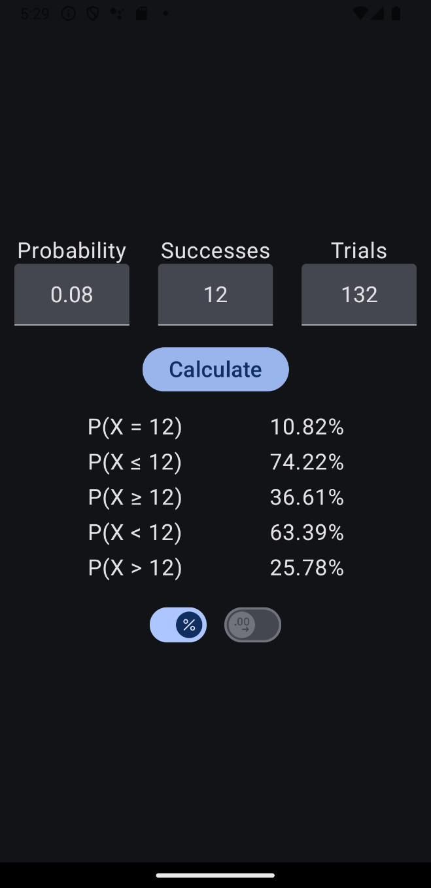

    
# Binomial Calculator (BC)
    

    

#### Overview

This application is designed to calculate probabilities associated with the binomial distribution ([Wikipedia](https://en.wikipedia.org/wiki/Binomial_distribution)).

#### Features
- **Input Parameters**:
    - **Probability**: Enter the probability of success on a single trial.
    - **Number of Successes**: Enter the desired number of successes.
    - **Number of Trials**: Enter the total number of trials.

- **Probability Calculations**:
    - **P(X = x)**: The probability of exactly x successes.
    - **P(X < x)**: The probability of fewer than x successes.
    - **P(X ≤ x)**: The probability of x or fewer successes.
    - **P(X > x)**: The probability of more than x successes.
    - **P(X ≥ x)**: The probability of x or more successes.

- **Display Options**:
    - **Percentages or Probabilities**: Choose to display results as either percentages or probabilities.
    - **Rounded or Full Precision Values**: Select between rounded values or full precision values.

The Binomial Calculator is designed to simplify the process of calculating binomial probabilities by providing a straightforward interface and flexible display options.
